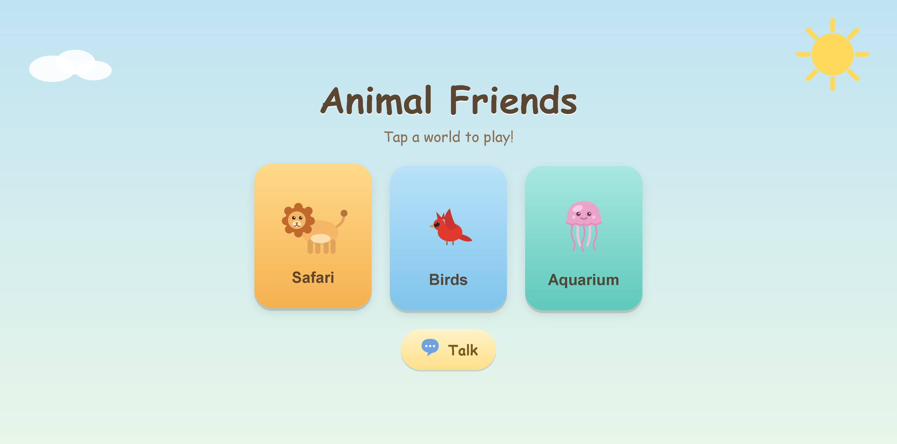
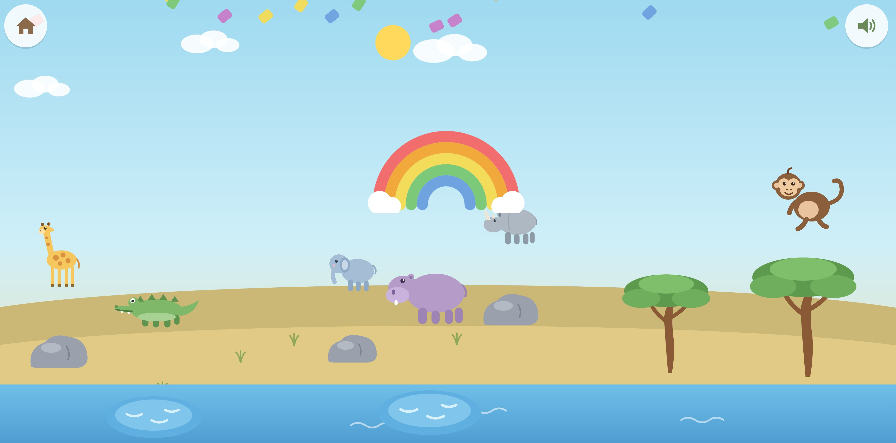
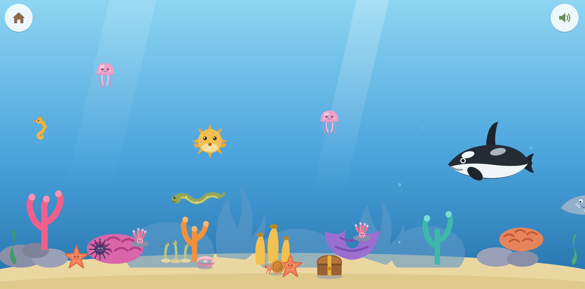
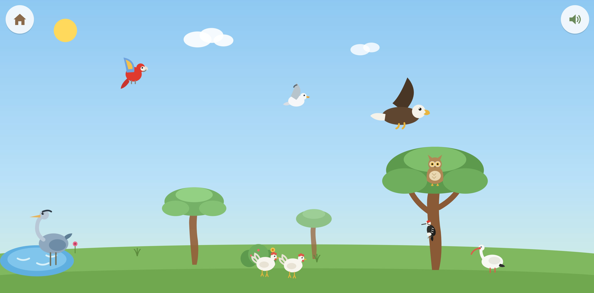
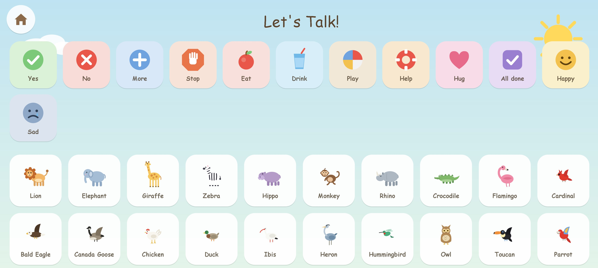

# Animal Speak


**How to play:**

Animal Speak is available on any device through the following URL:

https://catpockets.github.io/AnimalSpeak/

**Animal Speak** is a gentle, animal-themed browser game designed for autistic children, early learners, and kids who enjoy calm interactive play.

The game runs directly in the browser as a single-page static web app. It does not require an app store, login, account, backend server, database, build system, or installation. Animal Speak was originally created for my son as a simple, joyful way to explore animals, hear animal names, and interact with friendly animated creatures.

## 🌿 What It Is

Animal Speak is a touch-friendly animal exploration game with three interactive worlds:

* **Safari** — search for animals in a calm safari hide-and-seek world.
* **Aquarium** — explore an underwater coral reef and tap sea animals to see them move, play, or react.
* **Birds** — explore a bird world with different birds and gentle interactions.

The game also includes a simple built-in **Talk board** inspired by AAC communication tools. Kids can tap basic words and phrases such as “Yes,” “No,” “More,” “Stop,” “Eat,” “Drink,” “Play,” “Help,” “Hug,” and “All done.”

## 🐘 Features

* Three animal worlds: Safari, Aquarium, and Birds
* Interactive animals with animations and sounds
* Spoken animal names using browser speech
* Simple AAC-style Talk board
* Touch-friendly buttons for tablets
* Designed for calm, predictable play
* No score
* No losing
* No ads
* No accounts
* No reading required
* No time pressure
* Works as a static browser game

## 🧩 Why I Made This

I built Animal Speak for my autistic son.

Many games for kids are too loud, too fast, too distracting, or built around winning and losing. I wanted something slower, softer, and more predictable — a game where the goal is simply to explore, tap animals, hear their names, and enjoy cause-and-effect interactions.

Animal Speak is designed around joy, familiarity, and accessibility instead of competition.

## 🗣️ AAC / Talk Board

Animal Speak includes a very simple Talk board to support early communication.

This is not intended to replace a dedicated AAC device or professional communication system. It is a small built-in support feature for play, practice, and expression inside the game.

The Talk board currently includes basic communication buttons such as:

* Yes
* No
* More
* Stop
* Eat
* Drink
* Play
* Help
* Hug
* All done

## 🐬 Example Interactions

Kids can tap animals to hear their names and see them respond.

Examples:

* Tap a dolphin and it can flip.
* Tap a whale and it can move or spout.
* Tap birds and they can flap, hop, or react.
* Tap safari hiding spots to discover animals.

The design is intentionally simple: tap, watch, listen, enjoy.

## 📱 Play Online

Animal Speak is hosted with GitHub Pages:

https://catpockets.github.io/AnimalSpeak/

## 🍎 Tablet Use

Animal Speak is designed to work well on tablets.

For iPad:

1. Open the Animal Speak link in Safari.
2. Tap the Share button.
3. Select **Add to Home Screen**.
4. Name it **Animal Speak**.
5. Tap **Add**.

The game will then appear on the tablet home screen like an app.

## 🛠️ Tech Stack

Animal Speak is built with:

* HTML
* CSS
* JavaScript
* Inline SVG artwork
* Browser speech synthesis
* Browser audio features
* Web app manifest support
* Static hosting through GitHub Pages

There is no build system, package manager, database, or server required.

## ♿ Accessibility Design Goals

Animal Speak is designed to be:

* Calm
* Predictable
* Touch-friendly
* Low-pressure
* Visually playful
* Simple to navigate
* Friendly for children who do not read yet
* Supportive of cause-and-effect learning

The game avoids failure states, timers, competitive scoring, and punishment loops.

## 🖼️ Screenshots

### Home Screen



### Safari Mode



### Aquarium Mode



### Birds Mode



### Talk Board



## 📁 Repository Structure

```text
AnimalSpeak/
├── index.html
├── manifest.json
├── README.md
├── LICENSE.md
└── assets/
    ├── Aquarium.jpg
    ├── Birds.jpg
    ├── Home.jpg
    ├── Safari.jpg
    ├── Talk.jpg
    └── jellyfish-icon.png
```

## 🧪 Project Status

Animal Speak is an early personal project and a work in progress.

Planned and possible future improvements include:

* More AAC buttons
* Customizable Talk board
* Parent and teacher settings
* More animals
* More interaction types
* Optional reduced-motion mode
* Optional high-contrast mode
* Offline/PWA improvements
* Saved preferences
* Multiple voice options

## ❤️ Made With Love

Animal Speak was made for my son and for kids like him.

My mission is to make sure this remains free and available for children, families, teachers, therapists, and caregivers who need gentle, accessible learning tools.

This project is shared in that spirit: to help children explore, communicate, and play at their own pace.

## 📄 License

Animal Speak is intended to remain free for children and families who need it.

This project uses a dual-license approach:

* **Code:** GNU General Public License v3.0
* **Artwork, documentation, and educational content:** Creative Commons Attribution-NonCommercial-ShareAlike 4.0 International

This means the code can be studied, shared, and improved, while the child-focused creative content is protected from commercial exploitation.

See `LICENSE.md` for details.
